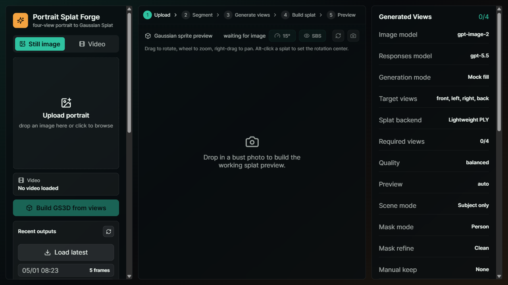
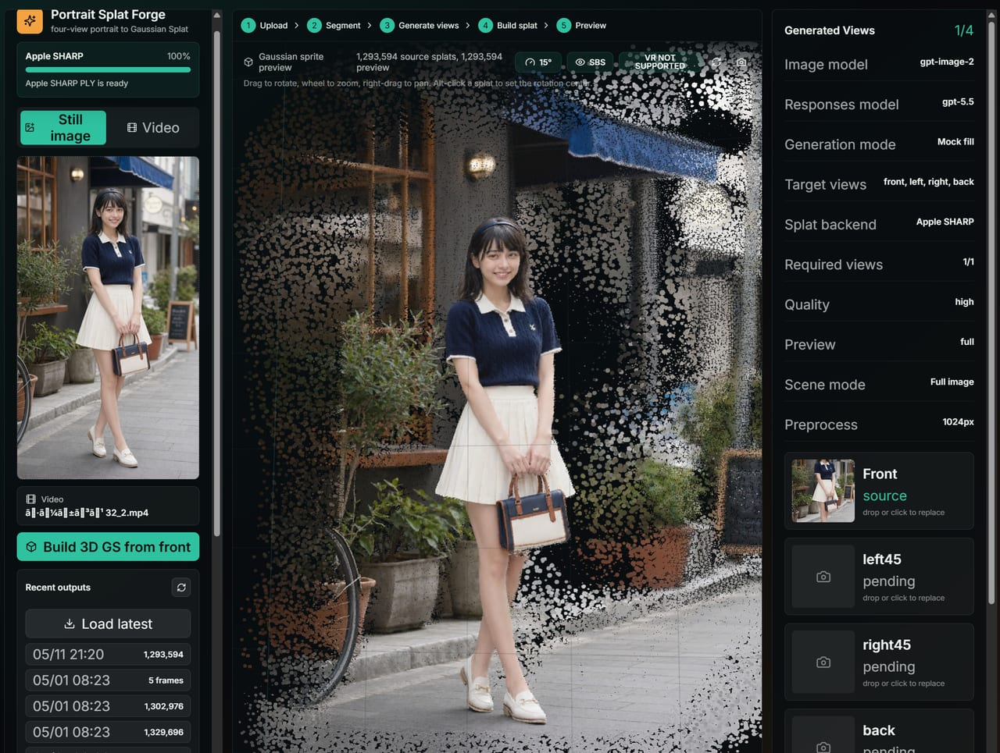
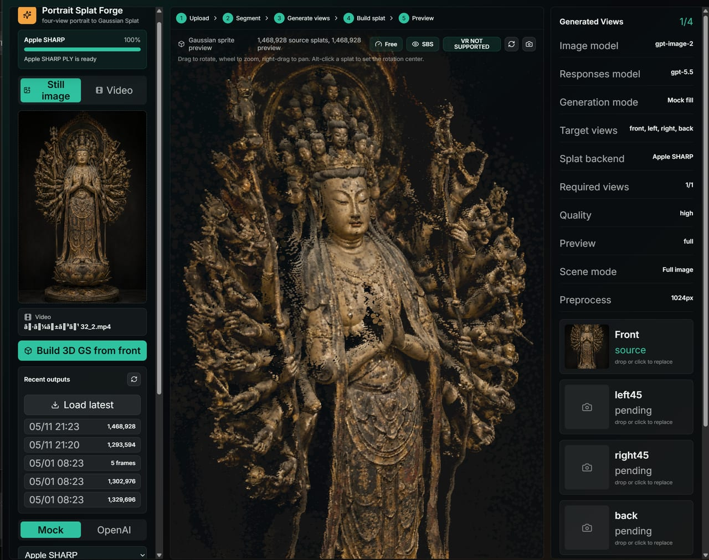

# Portrait Splat Forge

Portrait Splat Forge は、ポートレート画像や動画フレームから 3D Gaussian Splatting 風のプレビューを作るための実験的な Web アプリです。

静止画では Apple SHARP などの単一画像・少数画像向けバックエンドを試せます。動画では Quest Link / Air Link と PC GPU での利用を想定し、動画からフレームを抽出して既存の静的 GS バックエンドへ渡すためのワークフローを提供します。



## サンプル出力

Apple SHARP バックエンドを使った Full image / Full scene 系プレビューの例です。

| 背景込みポートレート | 立像・オブジェクト例 |
|---|---|
|  |  |

## 必要環境

- Node.js 20.19+ または 22.x。開発確認は Node.js 22 で行っています。
- npm 10+
- 内蔵マスク補助用に Python 3.9+
- 動画入力を使う場合は `ffmpeg` / `ffprobe`
- 本格的な外部3DGSバックエンドを使う場合は CUDA、conda、モデルチェックポイント、各バックエンド固有のセットアップ

## クイックスタート

```bash
npm install
npm run setup
npm run start
```

ブラウザで開きます。

```text
http://127.0.0.1:5173/
```

API サーバーは標準で `http://127.0.0.1:8787` で起動します。

標準ではローカル / モックモードで起動します。基本UIと軽量プレビューだけなら OpenAI API key や外部3DGSモデルは不要です。

## 環境設定

API key や外部バックエンドを設定する場合だけ `.env` を作成します。

```bash
cp .env.example .env
```

Windows PowerShell の場合:

```powershell
Copy-Item .env.example .env
```

`.env.example` をコピーしただけで Apple SHARP、InstantSplat、VGGT、gsplat、GaussianObject が自動で有効になることはありません。外部バックエンドは、ローカルに導入してから明示的にコマンドを設定してください。

## セットアップ詳細

JavaScript 依存関係は `package-lock.json` で固定しています。

同梱の `rembg` 環境は Python 3.9+ で動作するようにしています。外部研究バックエンドは Python 3.10 / 3.11 が必要になることがあります。

初回に npm 依存、`.venv-rembg`、Python requirements、rembg のセグメンテーションモデルまでまとめて準備する場合:

```bash
npm run setup:all
```

`setup:all` は `u2net_human_seg` と `isnet-general-use` をウォームアップして、初回生成時のモデルダウンロード待ちを減らします。

Apple SHARP、InstantSplat、VGGT、gsplat、GaussianObject などの外部研究バックエンドは自動ダウンロードしません。ソースコード、チェックポイント、モデル重みには別ライセンス、CUDA/Python制約、商用利用制限があり得るため、[THIRD_PARTY_NOTICES.md](THIRD_PARTY_NOTICES.md) を確認してから明示的に導入してください。

## 主な機能

- 静止画 / 動画ワークフローの切り替え
- 静止画からの Gaussian Splat プレビュー
- 動画アップロード、解析、フレーム抽出
- Apple SHARP / InstantSplat / VGGT + gsplat / 4-view Visual Hull などの外部バックエンド連携枠
- `Scene: Subject only / Full image` 切り替え
- `Mask: Person / Object+Props`
- `Mask refine: Clean / Keep props stronger`
- 手動 keep mask ペイント
- `Preview: Auto / Dense / Full`
- 角度制限 `5 / 10 / 15 / 25 / Free`
- WebXR `ENTER VR`
- SBS ステレオプレビュー
- スクリーンショット
- `.ply`, `.splat.json`, `.splat` エクスポート
- `Recent outputs / Load latest`

## 基本ワークフロー

### 静止画

1. `Still image` を選択します。
2. 画像をアップロードします。
3. 必要に応じて `Scene`、`Mask`、`Mask refine`、手動 keep mask を調整します。
4. `Build 3D GS from front` または 4-view backend で生成します。
5. Three.js ビューアで確認します。
6. `.ply`、`.splat.json`、`.splat` として保存できます。

### 動画

1. `Video` を選択します。
2. 動画をアップロードします。
3. `Analyze video` で解像度や長さを確認します。
4. `Extract frames` で指定枚数のフレームを抽出します。
5. 抽出フレームから SHARP sequence を作るか、4-view slots に割り当てて既存 backend へ渡します。

動画機能は、現時点では完全な dynamic video-GS trainer ではありません。動画からフレームを抽出し、静的 GS バックエンドへつなぐための橋渡しです。

## Apple SHARP について

Apple SHARP は、1枚画像から近距離の視点変化を表現する用途に向いたバックエンドです。

得意な用途:

- 1枚画像の立体写真化
- 背景込みシーンの軽い視差表現
- VR / AR 内で少し覗き込む表示

苦手な用途:

- 360度回転
- 背面や側面の正確な復元
- 見えていない部分の忠実な生成
- 人物や props を完全な3Dアセットとして再構築すること

目安として、`5〜15度` 程度の角度制限が実用範囲です。`25度` は確認用としては面白いですが、破綻が出やすくなります。

## Scene と Mask

`Scene: Subject only` は人物や対象物だけを抜き出すモードです。

- `Person`: 人物中心
- `Object+Props`: 小物や持ち物も拾いやすくする
- `Clean`: 背景ノイズを削る
- `Keep props stronger`: props を残す方向に寄せる
- 手動 keep mask: 「必ず残したい領域」をブラシで指定する

`Scene: Full image` は背景込みのシーンをそのまま扱うモードです。

未来都市、部屋、背景イラストなどは、Subject only より Full image の方が向いています。

## 動画入力の目安

Quest 単体ではなく、Quest Link / Air Link と PC GPU での利用を想定しています。

生成時間は動画の長さそのものより、抽出するフレーム数と解像度に強く依存します。

| 用途 | 解像度 | フレーム数 | 目安 |
|---|---:|---:|---|
| 動作確認 | 720p〜1080p | 30〜60 | まず形が出るか確認 |
| 標準 | 1080p | 60〜120 | バランス重視 |
| 高品質 | 1440p〜4K | 120〜200+ | 時間がかかる |

10秒動画でも、30fpsをすべて使うと300枚になります。最初は `30〜60 frames` から試すのがおすすめです。

## 外部 GS3D バックエンド

`/api/build-splat` は、入力画像を再現可能な job folder にステージングしてから外部 backend を呼び出します。

```text
outputs/jobs/{jobId}/input/images/front.png
outputs/jobs/{jobId}/input/images/left45.png
outputs/jobs/{jobId}/input/images/right45.png
outputs/jobs/{jobId}/input/images/back.png
outputs/jobs/{jobId}/input/manifest.json
outputs/jobs/{jobId}/output/
```

環境変数で backend を有効化します。

```bash
SHARP_COMMAND='node scripts/backends/run-sharp.mjs'
SHARP_CONDA_ENV=sharp

INSTANTSPLAT_COMMAND='node scripts/backends/run-instantsplat.mjs'
INSTANTSPLAT_ROOT=/path/to/InstantSplat
INSTANTSPLAT_CONDA_ENV=instantsplat

VGGT_GSPLAT_COMMAND='node scripts/backends/run-vggt-gsplat.mjs'
VGGT_ROOT=/path/to/VGGT
VGGT_CONDA_ENV=vggt
GSPLAT_ROOT=/path/to/gsplat
GSPLAT_CONDA_ENV=gsplat-train

FOUR_VIEW_FUSION_COMMAND='node scripts/backends/run-four-view-fusion.mjs'

OPEN_SPLAT_COMMAND='opensplat --input "{inputDir}" --output "{outputDir}/output.ply"'
GSPLAT_COMMAND='python /path/to/gsplat/train_four_view.py --manifest "{manifest}" --output "{outputDir}"'
CUSTOM_GS3D_COMMAND='your-command --input "{inputDir}" --output "{outputDir}"'
```

コマンド内では次のプレースホルダを使えます。

```text
{inputDir}
{outputDir}
{manifest}
{quality}
{jobId}
```

同じ値は環境変数としても渡されます。

```text
GS3D_INPUT_DIR
GS3D_OUTPUT_DIR
GS3D_MANIFEST
GS3D_QUALITY
GS3D_JOB_ID
```

バックエンドは `outputs/jobs/{jobId}/output/` に次のいずれかを書き出してください。

```text
output.splat.json
output.ply
output.splat
last.ply
point_cloud.ply
```

## 保存される成果物

生成物は `outputs/splats` に保存されます。

```text
outputs/splats/{id}.ply
outputs/splats/{id}.splat.json
outputs/splats/{id}.splat
outputs/splats/{id}.manifest.json
```

`Recent outputs` から最近の生成物を再読み込みできます。

## API

```text
POST /api/upload
POST /api/upload-video
POST /api/analyze-video
POST /api/extract-video-frames
POST /api/generate-views
POST /api/build-splat
POST /api/build-splat-job
POST /api/save-splat
GET  /api/build-splat-job/:id
GET  /api/recent-splats
GET  /api/health
```

## OpenAI Image Mode

OpenAI を使ったビュー生成を有効にする場合は、サーバー起動前に `.env` へ設定します。

```bash
OPENAI_API_KEY=
OPENAI_IMAGE_MODEL=gpt-image-2
```

アプリは標準ではローカル / モック生成モードで動作します。OpenAI mode を選んだ場合だけ、アップロード画像が OpenAI API に送信されます。

## QA

アプリを起動した状態で実行します。

```bash
npm run verify:render
```

`samples/mock-portrait.svg` をアップロードし、ビュー生成、splat生成、スクリーンショット取得、WebGL canvas の非空チェックを行います。

## 注意

- このプロジェクトは実験的なプロトタイプです。
- 1枚画像や少数画像から、完全な360度3Dモデルを復元するものではありません。
- 高品質な動画GS生成は時間がかかります。
- `outputs/`、`.env`、`node_modules/`、`.venv*`、ログ、`.ply/.splat` は Git 管理対象外です。

## License

Portrait Splat Forge 本体は MIT ライセンスです。

ただし、外部バックエンド、モデル重み、チェックポイント、API、生成物には、それぞれ別のライセンスや利用制限が適用される場合があります。特に Apple SHARP のモデル重みは Apple の研究用途向けモデルライセンスで配布されており、このリポジトリの MIT ライセンスには含まれません。

詳しくは [THIRD_PARTY_NOTICES.md](THIRD_PARTY_NOTICES.md) を確認してください。
